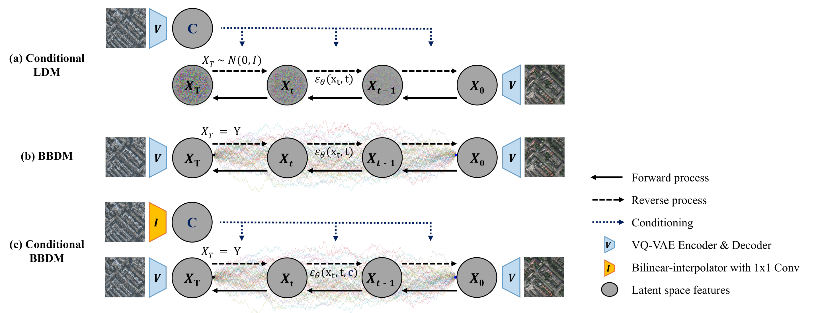

# ConditionalBBDM-for-VHR-SAR-to-Optical
This is the official implementation of [Conditional Brownian Bridge Diffusion Model for VHR SAR to Optical Image Translation](https://arxiv.org/abs/2408.07947).
https://arxiv.org/abs/2408.07947

**Seon-Hoon Kim, Daewon Chung**



## License & Attribution
This repository is based on the official BBDM implementation by Bo Li et al.

BBDM was originally proposed in the paper:

    Li, Bo, Xue, Kaitao, Liu, Bin, & Lai, Yu-Kun.
    BBDM: Image-to-image translation with Brownian bridge diffusion models.
    In Proceedings of the IEEE/CVF Conference on Computer Vision and Pattern Recognition (CVPR), 2023, pp. 1952–1961.

    https://arxiv.org/abs/2205.07680

The original source code is licensed under the MIT License, and this repository continues to comply with its terms.

This repo is heavily dependent on [LDM](https://github.com/CompVis/latent-diffusion) and [BBDM](https://github.com/xuekt98/BBDM).

## Requirements
```commandline
cond env create -f environment.yml
conda activate ConditionalBBDM
```

## Data preparation
### Paired translation task
For datasets that have paired image data, the path should be formatted as:
```yaml
your_dataset_path/train/SAR  # training SAR imagery
your_dataset_path/train/Optical  # training ground truth
your_dataset_path/val/SAR  # validating SAR imagery
your_dataset_path/val/Optical  # validating ground truth
your_dataset_path/test/SAR  # testing SAR imagery
your_dataset_path/test/Optical  # testing ground truth

```
After that, the dataset configuration should be specified in config file as:
```yaml
dataset_name: 'your_dataset_name'
dataset_type: 'SARtoOptical'
dataset_config:
  dataset_path: 'your_dataset_path'
```

### MSAW Dataset Preparation
If you want to use the MSAW dataset, you can preprocess it using the provided `MSAW_processing.py` script.

1. Place the original MSAW data in an appropriate directory.
2. Prepare the division line coordinates (see `division_line_coordinates.txt` for an example).
3. Run the preprocessing script as follows:
   ```bash
   python MSAW_processing.py --orig_dir [path_to_original_data] --target_height 512 --target_width 512
   ```


## Train and Test
### Specify your configuration file
Modify the configuration file based on our templates in <font color=violet><b>configs/Template-*.yaml</b></font>
Don't forget to specify your VQGAN checkpoint path and dataset path.

### Run
```commandline
sh shell/Template-ConditionalSARtoOptical.sh
```

## Pretrained Models
For simplicity, we re-trained all of the models based on the same VQGAN model from LDM.

The pre-trained VQGAN models provided by LDM can be directly used for all tasks.  
https://github.com/CompVis/latent-diffusion#bibtex

## Citation
```
@article{kim2025conditional,
  title={Conditional brownian bridge diffusion model for vhr sar to optical image translation},
  author={Kim, Seon-Hoon and Chung, Daewon},
  journal={IEEE Geoscience and Remote Sensing Letters},
  year={2025},
  publisher={IEEE}
}
```